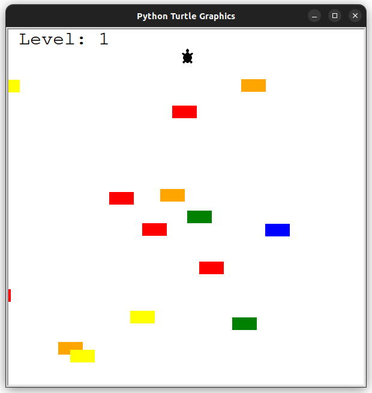
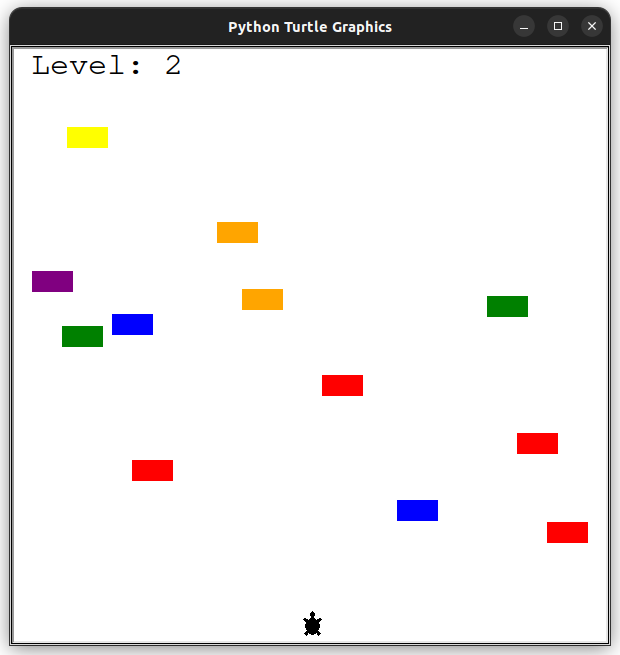
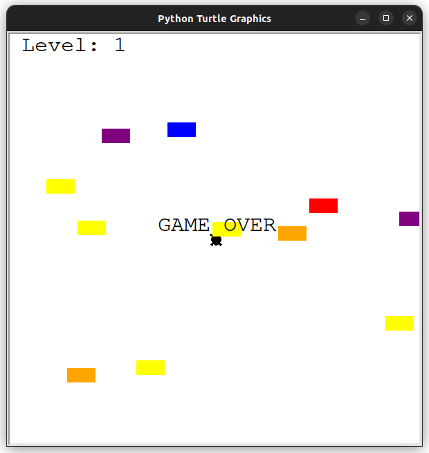

# Turtle Crosssing Game in Python

Tejas Acharya
[Twitter](https://twitter.com/achte_te)

A turtle crossing game that draws inspiration from the popular Crossy Road game. The turtle is controlled by the UP arrow key.

### Requirements:
[Turtle](https://docs.python.org/3/library/turtle.html)


To Run:
```sh
git clone git@github.com:achte-2022/Turtle-Crossing-Game.git
cd Turtle-Crossing-Game
python3 main.py
```

### Game Screen



### Level Up.



### GAME OVER screen when car hits turtle.

